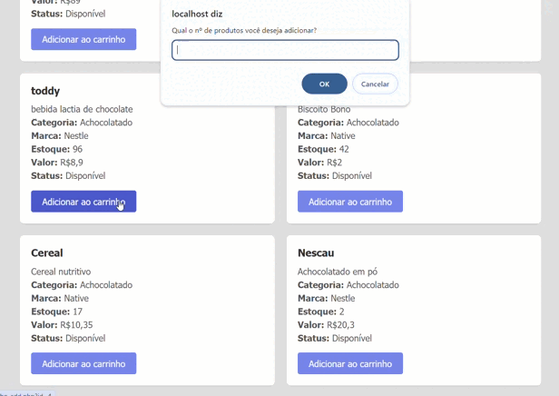
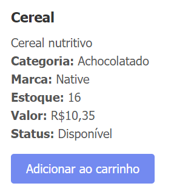
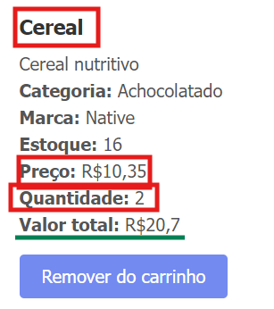
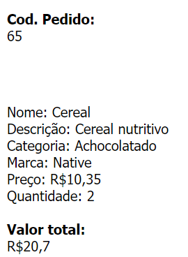
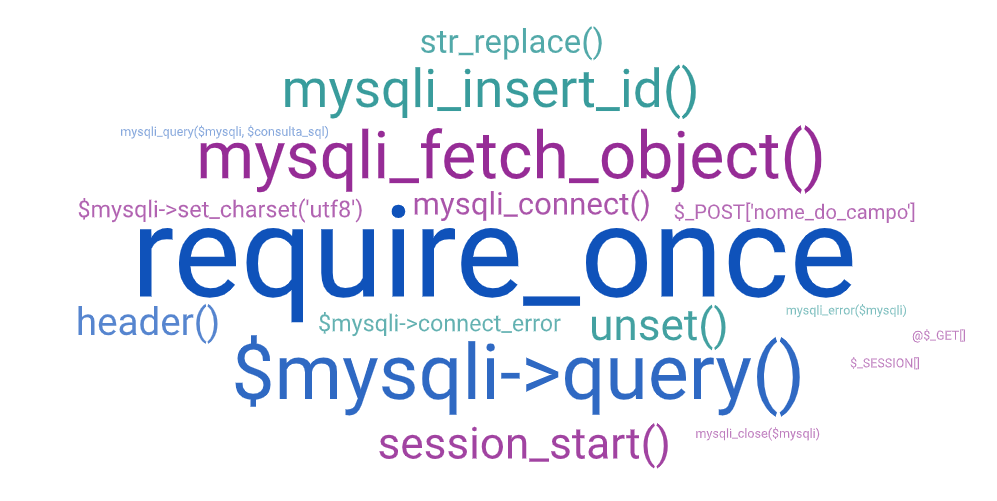

# Gestão de Compras

## Descrição

O repositório `gestao-compras` é um projeto de sistema de e-commerce desenvolvido para gerenciar categorias, marcas, produtos e pedidos. Este repositório contém todos os arquivos necessários para a implementação das funcionalidades básicas de um sistema de compras.

## Funcionalidades

O sistema oferece funcionalidades para gerenciar categorias, marcas, produtos, carrinho de compras e pedidos. Veja as principais funções:

**Gerenciamento de Categorias**  
Organize produtos em grupos para facilitar a navegação e busca. Adicione novas categorias, visualize as existentes e mantenha uma estrutura organizada.

**Gerenciamento de Marcas**  
Adicione novas marcas e associe produtos a fabricantes ou empresas. Visualize as marcas cadastradas para manter controle sobre as marcas disponíveis.  

    

**Gerenciamento de Produtos**  
Adicione produtos com nome, preço e descrição. Visualize todos os produtos disponíveis, modifique informações e remova itens descontinuados. Preços são exibidos e produtos podem ser adicionados ao carrinho para visualização do valor total.  

    
  

**Carrinho de Compras**  
Adicione e remova itens do carrinho. Visualize um resumo com a lista de produtos selecionados e o valor total da compra.  

    
  

**Pedidos**  
Crie novos pedidos após finalizar seleções. Visualize os pedidos realizados para acompanhar status e histórico de compras.  

## Tecnologias

<svg xmlns="http://www.w3.org/2000/svg" height="40px" viewBox="0 -960 960 960" width="40px" fill="#EA3323"><path d="M0-360v-240h60v80h80v-80h60v240h-60v-100H60v100H0Zm310 0v-180h-70v-60h200v60h-70v180h-60Zm170 0v-200q0-17 11.5-28.5T520-600h180q17 0 28.5 11.5T740-560v200h-60v-180h-40v140h-60v-140h-40v180h-60Zm320 0v-240h60v180h100v60H800Z"/></svg>
<svg xmlns="http://www.w3.org/2000/svg" height="40px" viewBox="0 -960 960 960" width="40px" fill="#FFFF55"><path d="M300-360q-25 0-42.5-17.5T240-420v-40h60v40h60v-180h60v180q0 25-17.5 42.5T360-360h-60Zm220 0q-17 0-28.5-11.5T480-400v-40h60v20h80v-40H520q-17 0-28.5-11.5T480-500v-60q0-17 11.5-28.5T520-600h120q17 0 28.5 11.5T680-560v40h-60v-20h-80v40h100q17 0 28.5 11.5T680-460v60q0 17-11.5 28.5T640-360H520Z"/></svg>
<svg xmlns="http://www.w3.org/2000/svg" height="40px" viewBox="0 -960 960 960" width="40px" fill="#5985E1"><path d="M420-360q-17 0-28.5-11.5T380-400v-40h60v20h80v-40H420q-17 0-28.5-11.5T380-500v-60q0-17 11.5-28.5T420-600h120q17 0 28.5 11.5T580-560v40h-60v-20h-80v40h100q17 0 28.5 11.5T580-460v60q0 17-11.5 28.5T540-360H420Zm260 0q-17 0-28.5-11.5T640-400v-40h60v20h80v-40H680q-17 0-28.5-11.5T640-500v-60q0-17 11.5-28.5T680-600h120q17 0 28.5 11.5T840-560v40h-60v-20h-80v40h100q17 0 28.5 11.5T840-460v60q0 17-11.5 28.5T800-360H680Zm-520 0q-17 0-28.5-11.5T120-400v-160q0-17 11.5-28.5T160-600h120q17 0 28.5 11.5T320-560v40h-60v-20h-80v120h80v-20h60v40q0 17-11.5 28.5T280-360H160Z"/></svg>
<svg xmlns="http://www.w3.org/2000/svg" height="40px" viewBox="0 -960 960 960" width="40px" fill="#FFFFFF"><path d="M120-360v-240h140q24 0 42 18t18 42v40q0 24-18 42t-42 18h-80v80h-60Zm260 0v-240h60v80h80v-80h60v240h-60v-100h-80v100h-60Zm280 0v-240h140q24 0 42 18t18 42v40q0 24-18 42t-42 18h-80v80h-60ZM180-500h80v-40h-80v40Zm540 0h80v-40h-80v40Z"/></svg>

## Inclusão de Código PHP

### `require_once('caminho/do/arquivo.php');`

Inclui e executa o código de um arquivo PHP uma única vez, garantindo que não seja incluído novamente.

## Funções e Métodos Usados

1. **`require_once`**  
   Inclui e executa um arquivo PHP uma vez.

2. **`$mysqli->query()`**  
   Executa uma consulta SQL no banco de dados.

3. **`mysqli_fetch_object()`**  
   Recupera uma linha de resultado da consulta SQL como um objeto.

4. **`mysqli_insert_id()`**  
   Retorna o ID do último item inserido com AUTO_INCREMENT.

5. **`session_start()`**  
   Inicia ou retoma uma sessão PHP.

6. **`unset()`**  
   Remove uma variável ou um item específico de uma array.

7. **`header()`**  
   Envia um cabeçalho HTTP para redirecionar o navegador.

8. **`str_replace()`**  
   Substitui caracteres em uma string.

9. **`mysqli_connect()`**  
   Conecta ao banco de dados.

10. **`$mysqli->set_charset('utf8')`**  
    Define o charset para UTF-8.

11. **`$mysqli->connect_error`**  
    Verifica erros de conexão e encerra o script se houver algum.

12. **`$_POST['nome_do_campo']`**  
    Obtém valores enviados por um formulário via método POST.

13. **`mysqli_query($mysqli, $consulta_sql)`**  
    Executa uma consulta SQL no banco de dados, como inserções ou atualizações.

14. **`mysqli_error($mysqli)`**  
    Fornece informações sobre erros durante a execução da consulta SQL.

15. **`mysqli_close($mysqli)`**  
    Fecha a conexão com o banco de dados, liberando recursos.

16. **`@$_GET[]`**  
    Acessa parâmetros passados pela URL, com controle de erro.

17. **`$_SESSION[]`**  
    Armazena dados na sessão do usuário.

## Créditos

**Autora:** Larissa Manrique  
**Orientador:** Professor Leonardo Rocha [GitHub](https://github.com/LeonardoRochaMarista)  
**Material disponibilizado por:** Professor Anderson Macedo.
